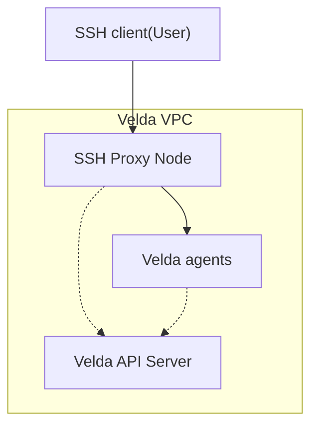
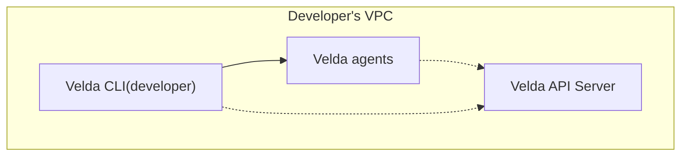

Depending on the network policy of your cluster, there are several options to connect to your cluster.
Velda only allocates the login node when your connection starts.

## Option 1: Fully Private Network (SSH Proxy)

In this configuration, the Velda API server and all instances are isolated within a private network and not directly accessible from the internet. Access is provided through a dedicated SSH proxy node.



**Characteristics:**

- **Security**: Maximum isolation - API server and instances are not exposed to the internet
- **Access Method**: SSH through proxy node with `SetEnv=VELDA_INSTANCE` to specify target instance
- **Use Case**: Recommended for production environments with strict security requirements
- **Limitation**: All traffic passes through the SSH proxy, which may add latency

**Connection Flow:**

1. Client initiates SSH connection to the proxy node
2. SSH environment variable `VELDA_INSTANCE` specifies the target instance
3. Proxy forwards traffic to the selected instance within the private network
4. All communication is tunneled through the SSH connection

In this mode, connecting to your instance is simple:

```
ssh -o SetEnv=VELDA_INSTANCE=[instance-name] velda@[velda-proxy]
```

## Option 2: Same VPC Connection (Direct Access)

In this configuration, your client is located within the same Virtual Private Cloud (VPC) or has direct network access to the Velda cluster through VPN, Direct Connect, or similar technologies.



**Characteristics:**

- **Performance**: Lower latency - direct connection to your login node without proxy overhead
- **Flexibility**: Choose between Velda CLI (direct gRPC) or SSH proxy methods
- **Setup Complexity**: Requires network configuration (VPN, VPC peering, Direct Connect, etc.)
- **Use Case**: Ideal for users with existing VPC infrastructure or those requiring high-performance access


### Connection
1. Install the client commandline tool (CLI) from the [releases page](https://github.com/velda-io/velda/releases).

2. Initialize the client to connect to the cluster.
```bash
velda init --broker=${APISERVER}:50051
```

3. Connect to instance
```bash
velda config set --instance my-instance # This is only needed one time.
velda run

# Alternatively, explicitly specify instance at every command
velda run --instance my-instance
```

4. Connect with SSH or IDEs
To use other SSH client, ensure you can use `velda run` to connect in previous section, and add the following configs to `~/.ssh/config`:
```
Host [instance-name]
  HostName [instance-name]
  Port 2222
  User user
  ProxyCommand velda port-forward -W -p %p --instance %h -s ssh
  StrictHostKeyChecking no
  UserKnownHostsFile /dev/null
```
Replace `[instance-name]` with the actual instance name.

5. For IDE access, set SSH config from previous step and use your IDE's SSH connection. Please refer to document on your IDE on how to connect wit SSH.

For enterprise/velda-cloud, you may also use [Velda VSCode extension](https://marketplace.visualstudio.com/items?itemName=velda-io.velda) or [VSX](https://open-vsx.org/extension/velda-io/velda)

## Control the access to an instance

For the Open-source edition, access control is implemented through SSH keys.

By default, every instance is accessible to everyone in the same network.

Access control will be enforced if any authorized key is added.

Authorized keys are stored at `/.velda/authorized_keys`.

```bash
# Generate an SSH key
ssh-keygen -f ~/.ssh/velda -t ed25519
# Add the key to authorized_keys
cat ~/.ssh/velda.pub | velda run -u root bash -c 'cat >> /.velda/authorized_keys'
velda config set --identity-file ~/.ssh/velda
```

To access the instance after setting up the identity file:
```bash
velda run
```
Alternatively, use the full command:
```bash
velda run --instance [instance-name] --identity-file [path-to-private-key]
```

### Reset access
If you lose access, a cluster admin (someone with direct access to the apiserver node) may recover access by removing the `authorized_keys` file:

1. Identify your numeric instance ID by running `velda instance list`
2. From the control plane, remove `/zpool/[instance-id]/.velda/authorized_keys`