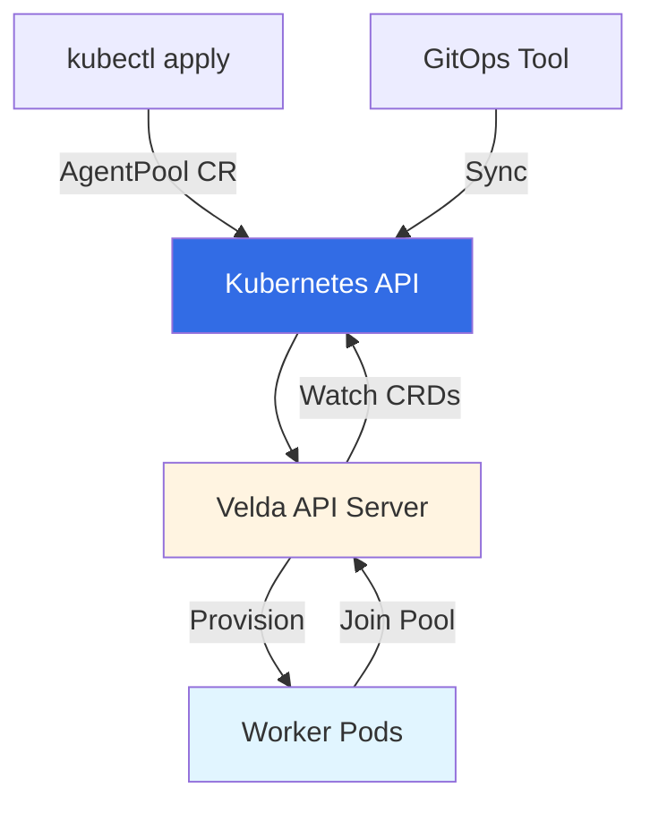

# Kubernetes CRD Integration

Velda provides native Kubernetes integration through Custom Resource Definitions (CRDs), allowing you to manage resource pools using standard Kubernetes workflows and tools.

## Overview

The Kubernetes CRD integration enables you to:

- Define pools as Kubernetes custom resources (`AgentPool` CRD)
- Embed pod templates and autoscaling config directly in the CR
- Use `kubectl` to manage pool configurations
- Integrate with GitOps workflows (ArgoCD, FluxCD)
- Leverage Kubernetes RBAC for access control
- Apply standard Kubernetes practices to pool management

## Architecture



The Velda API server watches for `AgentPool` custom resources and automatically:
1. Creates/updates pools when CRs are created/modified
2. Provisions worker pods based on the embedded pod template
3. Removes pools when CRs are deleted

## Prerequisites

- Kubernetes cluster (1.19+)
- Velda API server deployed in the cluster
- `kubectl` configured to access your cluster

## Installation

### 1. Install the AgentPool CRD

First, install the Custom Resource Definition:

```bash
kubectl apply -f https://raw.githubusercontent.com/velda-io/velda/main/k8s/crd/agentpool-crd.yaml
```
### 2. Configure the Kubernetes Provisioner

Update your Velda API server configuration to enable the Kubernetes provisioner. 
It uses current kubectl context when velda starts.
```yaml
provisioners:
  - kubernetes:
      namespace: "velda"
```

For Google Kubernetes Engine (GKE) cluster:
```yaml
# velda-config.yaml
provisioners:
  - kubernetes:
      namespace: "velda"
      gke:
        project: "my-gcp-project"
        location: "us-central1"
        cluster_name: "velda-cluster"
```

Then restart the API server: 
```
sudo systemctl restart velda-apiserver
```

## AgentPool Resource Specification

The `AgentPool` CRD embeds both the pod template and autoscaling configuration directly in the custom resource.

### Complete Structure

```yaml
apiVersion: velda.io/v1
kind: AgentPool
metadata:
  name: pool-name
  namespace: velda
spec:
  # Autoscaling configuration
  autoscaler:
    minReplicas: 0              # Minimum agents in pool
    maxReplicas: 20             # Maximum agents in pool
    minIdle: 2                  # Minimum idle agents to maintain
    maxIdle: 5                  # Maximum idle agents before scale-down
    idleDecaySecond: 60         # Seconds to wait before removing idle agents
    killUnknownAfterSecond: 300 # Seconds before killing unknown workers
    defaultSlotsPerAgent: 1     # Sessions per agent
  
  # Pod template (embedded directly)
  template:
    metadata:
      labels:
        app: velda-agent
        pool: pool-name
    spec:
      containers:
        - name: agent
          image: velda/agent:latest
          # ... container spec
```

### Autoscaler Fields

| Field | Type | Default | Description |
|-------|------|---------|-------------|
| `minReplicas` | int | 0 | Minimum number of agents to maintain |
| `maxReplicas` | int | Required | Maximum number of agents allowed |
| `minIdle` | int | Required | Minimum idle agents/slots to keep ready |
| `maxIdle` | int | Required | Maximum idle agents before scale-down |
| `idleDecaySecond` | int | 60 | Seconds to wait before removing idle agents |
| `killUnknownAfterSecond` | int | 300 | Seconds before deleting unknown workers |
| `defaultSlotsPerAgent` | int | 1 | Number of concurrent sessions per agent |

### Template Field

The `template` field is a complete Kubernetes Pod specification. It must include:
- At least one label (used to identify pods belonging to this pool)
- Container specification for the Velda agent
- Configuration provided via ConfigMap mounted at `/run/velda` (contains `velda.yaml` with broker address and other settings)

Agent configuration is typically provided through a ConfigMap rather than environment variables. The ConfigMap should contain a `velda.yaml` file with broker connection details and sandbox configuration.

## Creating Agent Pools

### Basic CPU Pool

```yaml
apiVersion: velda.io/v1
kind: AgentPool
metadata:
  name: cpu-pool
  namespace: default
spec:
  autoscaler:
    minReplicas: 2
    maxReplicas: 20
    minIdle: 3
    maxIdle: 8
    idleDecaySecond: 300
    defaultSlotsPerAgent: 1
  template:
    metadata:
      labels:
        app: velda-agent
        pool: cpu-pool
    spec:
      containers:
        - name: agent
          image: veldaio/agent:latest
          args:
            - '--pool=cpu-pool'
          securityContext:
            privileged: true
          resources:
            requests:
              memory: "8Gi"
              cpu: "4"
            limits:
              memory: "8Gi"
              cpu: "4"
          volumeMounts:
            - name: velda-config
              mountPath: /run/velda
      volumes:
        - name: velda-config
          configMap:
            name: velda-config
```

Create the Velda configuration ConfigMap:

```yaml
apiVersion: v1
kind: ConfigMap
metadata:
  name: velda-config
  namespace: default
data:
  velda.yaml: |
    broker:
      address: "velda-apiserver.default.svc.cluster.local:50051"
    sandbox_config:
      disk_source:
        nfs_mount_source: 
          mount_options: nolock
```

Apply the configuration and pool:

```bash
kubectl apply -f velda-config.yaml
kubectl apply -f cpu-pool.yaml
```

### GPU Pool with NVIDIA GPUs

```yaml
apiVersion: velda.io/v1
kind: AgentPool
metadata:
  name: gpu-pool
  namespace: default
spec:
  autoscaler:
    minIdle: 1
    maxIdle: 3
    maxReplicas: 10
    idleDecaySecond: 600
    killUnknownAfterSecond: 900
    defaultSlotsPerAgent: 1
  template:
    metadata:
      labels:
        app: velda-agent
        pool: gpu-pool
        gpu-type: a100
    spec:
      containers:
        - name: agent
          image: veldaio/agent:latest
          args:
            - '--pool=gpu-pool'
          securityContext:
            privileged: true
          resources:
            requests:
              nvidia.com/gpu: 1
              memory: "32Gi"
              cpu: "8"
            limits:
              nvidia.com/gpu: 1
              memory: "32Gi"
              cpu: "8"
          volumeMounts:
            - name: velda-config
              mountPath: /run/velda
      volumes:
        - name: velda-config
          configMap:
            name: velda-config
      nodeSelector:
        cloud.google.com/gke-accelerator: nvidia-tesla-a100
      tolerations:
        - key: nvidia.com/gpu
          operator: Exists
          effect: NoSchedule
```

### Lightweight Shell Pool

Based on real-world usage - a minimal pool for shell access and interactive work:

```yaml
apiVersion: velda.io/v1
kind: AgentPool
metadata:
  name: shell
  namespace: default
spec:
  autoscaler:
    minIdle: 1
    maxIdle: 2
    maxReplicas: 4
    idleDecaySecond: 60
  template:
    metadata:
      labels:
        app: velda-agent-shell
        group: velda-agent
        type: shell
    spec:
      containers:
        - name: agent
          image: veldaio/agent:latest
          args:
            - '--pool=shell'
          securityContext:
            privileged: true
          resources:
            requests:
              cpu: "0.1"
              memory: 0.25Gi
            limits:
              cpu: 1
              memory: 1Gi
          volumeMounts:
            - name: velda-config
              mountPath: /run/velda
      volumes:
        - name: velda-config
          configMap:
            name: velda-config
```

This lightweight pool is ideal for:
- Interactive shell sessions
- Quick debugging and testing
- Development environments
- Low-resource tasks

Note the minimal resource requests (0.1 CPU, 256Mi memory) which allow many shell sessions to run on a single node.

## Managing Pools with kubectl

### List Pools

```bash
kubectl get agentpools -n default
# Or using short name
kubectl get ap -n default
```

Output:
```
NAME        AGE
cpu-pool    2d
gpu-pool    1d
shell       4h
```

### View Pool Details

```bash
kubectl describe agentpool shell -n default
```

### Get Pool as YAML

```bash
kubectl get agentpool shell -n default -o yaml
```

### Update a Pool

Edit the AgentPool resource:

```bash
kubectl edit agentpool gpu-pool -n default
```

Or apply a modified YAML:

```bash
kubectl apply -f gpu-pool-updated.yaml
```

Changes are automatically synced to the Velda API server.

### Delete a Pool

```bash
kubectl delete agentpool cpu-pool -n default
```

This removes the pool and terminates all worker pods.

### Check Worker Pods

```bash
# All worker pods
kubectl get pods -n default -l group=velda-agent

# Pods for specific pool
kubectl get pods -n default -l app=velda-agent,pool=gpu-pool

# With more details
kubectl get pods -n default -l group=velda-agent -o wide
```

## Best Practices

### 1. Use ConfigMap for Configuration

Always use a ConfigMap to provide agent configuration instead of environment variables:

```yaml
volumes:
  - name: velda-config
    configMap:
      name: velda-config
volumeMounts:
  - name: velda-config
    mountPath: /run/velda
```

### 2. Use the --pool Argument

Specify the pool name via command argument:

```yaml
args:
  - '--pool=my-pool-name'
```

### 3. Set Privileged Security Context

Agents typically require privileged containers to manage workload isolation:

```yaml
securityContext:
  privileged: true
```

### 4. Use Meaningful Labels

```yaml
metadata:
  labels:
    app: velda-agent-shell
    group: velda-agent
    type: shell
    environment: production
    team: ml-engineering
```

Labels are used by the provisioner to identify and manage pods.

### 5. Set Appropriate Resource Limits

Match resource requests and limits to your workload type:

```yaml
# Lightweight shell pool
resources:
  requests:
    cpu: "0.1"
    memory: 0.25Gi
  limits:
    cpu: 1
    memory: 1Gi

# Heavy compute pool
resources:
  requests:
    cpu: "16"
    memory: "64Gi"
  limits:
    cpu: "16"
    memory: "64Gi"
```

### 6. minReplicas is Optional

The `minReplicas` field defaults to 0, which allows pools to scale to zero when idle. Only set it if you need guaranteed minimum capacity.

### 7. Use GitOps

Store all AgentPool definitions in Git and deploy via ArgoCD/FluxCD for:
- Version control
- Audit trails
- Rollback capability
- Review processes

## Troubleshooting

### Pools Not Appearing

**Check:**

1. CRD is installed:
```bash
kubectl get crd agentpools.velda.io
```

2. Provisioner is configured in API server config

3. API server has RBAC permissions:
```bash
kubectl auth can-i list agentpools.velda.io \
  --as=system:serviceaccount:velda:velda-apiserver \
  -n default
```

### Workers Not Starting

**Check:**

1. Pod template is valid:
```bash
kubectl get agentpool <pool-name> -n default -o yaml
```

2. ConfigMap exists:
```bash
kubectl get configmap velda-config -n default
```

3. Pod status and events:
```bash
kubectl get pods -n default -l group=velda-agent
kubectl describe pod <pod-name> -n default
```

4. Template has required labels:
```bash
# The template MUST have at least one label
kubectl get agentpool <pool-name> -o jsonpath='{.spec.template.metadata.labels}'
```

### Pods in Pending State

Common causes:

1. **Insufficient resources**: Check node capacity
2. **Image pull errors**: Verify image name and registry access
3. **Node selector mismatch**: Ensure nodes match selectors
4. **ConfigMap not found**: Verify ConfigMap exists

```bash
kubectl describe pod <pod-name> -n default | grep -A 5 Events
```

### Permission Denied

**Fix RBAC:**

```bash
# Check current permissions
kubectl auth can-i --list \
  --as=system:serviceaccount:velda:velda-apiserver \
  -n default

# Apply role and binding
kubectl apply -f velda-rbac.yaml
```

## Next Steps

- **[Pool Provisioners](pool-provisioners.md)**: Learn about other provisioner types
- **[Pool Backends Reference](pool-backends.md)**: Configure backend infrastructure
- **[Autoscaling Configuration](pool-autoscaling.md)**: Tune autoscaling behavior
- **[Main Configuration Guide](pools-configuration.md)**: Overall pool setup

## Resources

- [Kubernetes Custom Resources](https://kubernetes.io/docs/concepts/extend-kubernetes/api-extension/custom-resources/)
- [ArgoCD Documentation](https://argo-cd.readthedocs.io/)
- [FluxCD Documentation](https://fluxcd.io/docs/)
- [Kubernetes RBAC](https://kubernetes.io/docs/reference/access-authn-authz/rbac/)
