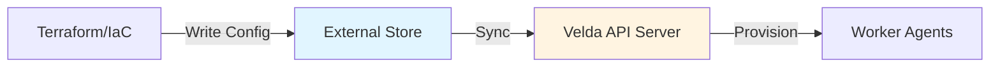

# Pool Provisioners

Pool provisioners allow you to manage pool configurations externally from the API server's main configuration file. They enable dynamic pool updates, team-based pool management, and better integration with Infrastructure-as-Code tools like Terraform.

## Overview

Instead of defining all pools directly in the API server's configuration file, provisioners allow you to:

- Store pool configurations in external systems (AWS SSM, GCS, Kubernetes)
- Update pools without restarting the API server
- Manage pools with Terraform or other IaC tools
- Separate pool management from API server deployment
- Enable different teams to manage their own pools independently

## How Provisioners Work

The API server periodically syncs pool configurations from external sources:

1. **Discovery**: Provisioner scans external storage for pool configurations
2. **Parsing**: Configurations are parsed and validated
3. **Synchronization**: Pools are created, updated, or removed to match external state
4. **Monitoring**: Changes are detected on the next sync interval



## Available Provisioners

Velda supports the following provisioner types:

| Provisioner | Storage | Best For |
|-------------|---------|----------|
| **AWS Provisioner** | AWS Systems Manager Parameter Store | AWS deployments, Terraform |
| **GCS Provisioner** | Google Cloud Storage | GCP deployments, Terraform |
| **Kubernetes Provisioner** | Kubernetes Custom Resources | K8s-native deployments |
| **AWS Auto Provisioner** | Built-in (generates pools) | Auto-discover AWS instance types |
| **Nebius Auto Provisioner** | Built-in (generates pools) | Multi-GPU Nebius deployments |
| **Mithril Auto Provisioner** | Built-in (generates pools) | Multi-instance Mithril pools |
| **DigitalOcean Auto Provisioner** | Built-in (generates pools) | Multi-droplet DigitalOcean pools |

---

## AWS Provisioner

Stores pool configurations in AWS Systems Manager (SSM) Parameter Store.

### Configuration

```yaml
provisioners:
  - aws:
      region: "us-west-2"
      config_prefix: "/velda/pools/"
      update_interval: "60s"
```

**Parameters:**
- `region`: AWS region where parameters are stored
- `config_prefix`: Path prefix for pool configuration parameters
- `update_interval`: How often to sync from SSM (default: 60s)

### Usage with Terraform

Create SSM parameters containing pool configurations:

```hcl
resource "aws_ssm_parameter" "gpu_pool" {
  name  = "/velda/pools/gpu-pool"
  type  = "String"
  value = jsonencode({
    name = "gpu-pool"
    auto_scaler = {
      backend = {
        aws_launch_template = {
          region                = "us-west-2"
          launch_template_name  = "velda-gpu-workers"
          instance_type         = "p3.2xlarge"
          ami_id                = data.aws_ami.velda_agent.id
          subnet_id             = aws_subnet.private.id
          security_group_ids    = [aws_security_group.velda_agent.id]
        }
      }
      max_agents      = 20
      min_idle_agents = 2
      max_idle_agents = 5
    }
  })
}

resource "aws_ssm_parameter" "cpu_pool" {
  name  = "/velda/pools/cpu-pool"
  type  = "String"
  value = jsonencode({
    name = "cpu-pool"
    auto_scaler = {
      backend = {
        aws_launch_template = {
          region                = "us-west-2"
          launch_template_name  = "velda-cpu-workers"
          instance_type         = "c5.4xlarge"
          ami_id                = data.aws_ami.velda_agent.id
          subnet_id             = aws_subnet.private.id
        }
      }
      max_agents      = 50
      min_idle_agents = 5
    }
  })
}
```

### Manual Creation

Using AWS CLI:

```bash
aws ssm put-parameter \
  --name "/velda/pools/my-pool" \
  --type "String" \
  --value '{
    "name": "my-pool",
    "auto_scaler": {
      "backend": {
        "aws_launch_template": {
          "region": "us-west-2",
          "instance_type": "p3.2xlarge"
        }
      },
      "max_agents": 10
    }
  }'
```

### Benefits for AWS Deployments

- **IAM Integration**: Use IAM roles for access control
- **Terraform Native**: Direct integration with Terraform AWS provider
- **Versioning**: SSM parameter history tracks changes
- **No Restarts**: Update pools without redeploying API server

---

## GCS Provisioner

Stores pool configurations as JSON files in Google Cloud Storage.

### Configuration

```yaml
provisioners:
  - gcs:
      bucket: "velda-pool-configs"
      config_prefix: "pools/"
      update_interval: "120s"
```

**Parameters:**
- `bucket`: GCS bucket name
- `config_prefix`: Path prefix within the bucket
- `update_interval`: Sync interval (default: 60s)

### Usage with Terraform

```hcl
resource "google_storage_bucket" "pool_configs" {
  name     = "velda-pool-configs"
  location = "US"
}

resource "google_storage_bucket_object" "gpu_pool" {
  name    = "pools/gpu-pool.json"
  bucket  = google_storage_bucket.pool_configs.name
  content = jsonencode({
    name = "gpu-pool"
    auto_scaler = {
      backend = {
        gce_instance_group = {
          project        = var.project_id
          zone           = "us-central1-a"
          instance_group = google_compute_instance_group_manager.gpu_workers.name
        }
      }
      max_agents      = 15
      min_idle_agents = 2
    }
  })
}
```

### Manual Creation

Using gsutil:

```bash
echo '{
  "name": "my-pool",
  "auto_scaler": {
    "backend": {
      "gce_instance_group": {
        "project": "my-project",
        "zone": "us-central1-a",
        "instance_group": "velda-workers"
      }
    },
    "max_agents": 10
  }
}' | gsutil cp - gs://velda-pool-configs/pools/my-pool.json
```

---

## Kubernetes Provisioner

Uses Kubernetes Custom Resource Definitions (CRDs) to manage pools.

### Configuration

```yaml
provisioners:
  - kubernetes:
      namespace: "velda-system"
      gke:
        project: "my-gcp-project"
        location: "us-central1"
        cluster_name: "velda-cluster"
```

**Parameters:**
- `namespace`: Kubernetes namespace to watch for AgentPool resources
- `gke`: (Optional) Google Kubernetes Engine cluster credentials

See [Kubernetes CRD Integration](pool-kubernetes-crd.md) for detailed information.

---

## Auto Provisioners

Auto provisioners automatically generate multiple pools based on templates or infrastructure discovery.

### AWS Auto Provisioner

Automatically creates pools for AWS instance types.

```yaml
provisioners:
  - aws_auto:
      pool_prefix: "aws"
      template:
        region: "us-west-2"
        subnet_id: "subnet-abc123"
        security_group_ids:
          - "sg-xyz789"
        ami_name: "velda-agent-*"
      instance_type_prefixes:
        - "p3."
        - "p4."
        - "g4dn."
      autoscaler_config:
        max_agents: 10
        min_idle_agents: 0
        max_idle_agents: 2
```

**Result**: Creates pools like `aws-p3.2xlarge`, `aws-p4d.24xlarge`, `aws-g4dn.xlarge`, etc.

**Benefits**:
- Automatic pool creation for all matching instance types
- Simplified configuration for large-scale deployments
- Consistent settings across instance types

### Nebius Auto Provisioner

Creates multiple pools for different GPU configurations.

```yaml
provisioners:
  - nebius_auto:
      parent_id: "folder-abc123"
      subnet_id: "subnet-xyz"
      use_public_ip: true
      admin_ssh_key: "ssh-rsa AAAAB3..."
      autoscaler_config:
        max_agents: 5
        min_idle_agents: 0
      pool_details:
        - pool_name: "h200-1gpu"
          platform: "gpu-h200-hxm"
          resource_preset: "1gpu-16vcpu-200gb"
          description: "Single H200 GPU"
        - pool_name: "h200-8gpu"
          platform: "gpu-h200-hxm"
          resource_preset: "8gpu-128vcpu-1600gb"
          description: "8x H200 GPU"
          autoscaler_config:
            max_agents: 2
```

**Features**:
- Define multiple pools with different GPU counts
- Override autoscaler settings per pool
- Shared base configuration

### Mithril Auto Provisioner

Creates pools for multiple Mithril spot bid configurations.

```yaml
provisioners:
  - mithril_auto:
      project_id: "proj_abc123"
      region: "us-west-2"
      api_token: "${MITHRIL_API_TOKEN}"
      ssh_key_ids:
        - "key_xyz"
      autoscaler_config:
        max_agents: 5
        min_idle_agents: 0
      pool_details:
        - pool_name: "h100-8x"
          instance_type: "8xh100"
          limit_price: 4.50
          description: "8x H100 spot instances"
        - pool_name: "a100-8x"
          instance_type: "8xa100"
          limit_price: 3.20
          description: "8x A100 spot instances"
      max_suspended_bids: 2
```

### DigitalOcean Auto Provisioner

Creates pools for multiple DigitalOcean droplet configurations.

```yaml
provisioners:
  - digitalocean_auto:
      region: "atl1"
      api_token: "${DIGITALOCEAN_API_TOKEN}"
      ssh_key_ids:
        - 12345678
      autoscaler_config:
        max_agents: 10
        min_idle_agents: 1
      pool_details:
        - pool_name: "mi300x-1gpu"
          size: "gpu-mi300x1-192gb-devcloud"
          image: "amd-rocm71software"
          description: "Single MI300X GPU"
        - pool_name: "mi300x-8gpu"
          size: "gpu-mi300x8-1536gb-devcloud"
          image: "amd-rocm71software"
          description: "8x MI300X GPU"
```

---

## Benefits of Provisioners

### 1. Terraform Integration

Provisioners enable native Terraform workflows:

```hcl
# Define pools alongside infrastructure
resource "aws_ssm_parameter" "ml_training_pool" {
  name  = "/velda/pools/ml-training"
  type  = "String"
  value = jsonencode({
    name = "ml-training"
    auto_scaler = {
      backend = {
        aws_launch_template = {
          instance_type = "p4d.24xlarge"
          subnet_id     = aws_subnet.training.id
        }
      }
      max_agents = var.max_training_nodes
    }
  })
}
```

### 2. Dynamic Updates

Change pools without API server restarts:

```bash
# Update pool via Terraform
terraform apply

# Or manually update SSM/GCS
aws ssm put-parameter --name /velda/pools/my-pool --value '...' --overwrite

# Changes applied on next sync (typically <60s)
```

### 3. Team Autonomy

Different teams manage their pools independently:

```
/velda/pools/
  ├── ml-team/
  │   ├── training-pool
  │   └── inference-pool
  ├── data-team/
  │   ├── etl-pool
  │   └── analytics-pool
  └── dev-team/
      └── sandbox-pool
```

### 4. GitOps Workflows

Version control pool configurations:

```bash
# pools/production/gpu-pool.json
git commit -m "Increase GPU pool max_agents to 20"
git push

# CI/CD pipeline updates SSM/GCS
# API server automatically syncs
```

---

## Best Practices

### 1. Use Provisioners for Production

**Don't:**
```yaml
# Directly in config file
agent_pools:
  - name: pool1
    # ...
  - name: pool2
    # ...
```

**Do:**
```yaml
# Use provisioner
provisioners:
  - aws:
      config_prefix: "/velda/pools/"
```

### 2. Organize by Environment

```
/velda/
  ├── staging/pools/
  │   ├── pool1
  │   └── pool2
  └── production/pools/
      ├── pool1
      └── pool2
```

### 3. Version Your Configurations

- Use Terraform/IaC for all pool changes
- Store configurations in Git
- Use pull requests for review
- Tag releases

### 4. Monitor Sync Status

Check API server logs for provisioner sync activity:

```bash
kubectl logs -f velda-apiserver | grep provisioner
# or
journalctl -u velda-apiserver -f | grep provisioner
```

### 5. Set Appropriate Intervals

```yaml
update_interval: "60s"  # Balance freshness vs. API costs
```

- **Fast (30s)**: Development, frequent changes
- **Normal (60s)**: Production, standard
- **Slow (5m)**: Stable production, cost-sensitive

### 6. Use Auto Provisioners for Scale

When managing 10+ pools with similar configuration, use auto provisioners instead of individual pool definitions.

---

## Combining Provisioners and Static Pools

You can use both provisioners and static pool definitions:

```yaml
# Static pools (always present)
agent_pools:
  - name: "critical-pool"
    auto_scaler:
      max_agents: 5
      # ...

# Dynamic pools (from provisioner)
provisioners:
  - aws:
      config_prefix: "/velda/pools/"
```

**Static pools** are useful for:
- Critical infrastructure that shouldn't change
- Pools managed by the cluster itself
- Bootstrap pools

---

## Troubleshooting

### Pools Not Appearing

**Check:**
1. API server has permissions to read from external store (IAM/RBAC)
2. Configuration prefix is correct
3. JSON format is valid
4. Sync interval has elapsed
5. API server logs for errors

```bash
# Check AWS IAM permissions
aws sts get-caller-identity

# Validate JSON
cat pool.json | jq .

# Check logs
kubectl logs velda-apiserver | grep "provisioner"
```

### Pools Not Updating

**Verify:**
1. Changes were actually written to external store
2. Sufficient time elapsed for next sync
3. No validation errors in API server logs
4. Provisioner is enabled in config

### Permission Errors

**AWS:**
```json
{
  "Statement": [{
    "Effect": "Allow",
    "Action": [
      "ssm:GetParameter",
      "ssm:GetParametersByPath"
    ],
    "Resource": "arn:aws:ssm:*:*:parameter/velda/pools/*"
  }]
}
```

**GCP:**
```bash
gcloud projects add-iam-policy-binding PROJECT_ID \
  --member="serviceAccount:velda@PROJECT.iam.gserviceaccount.com" \
  --role="roles/storage.objectViewer"
```

---

## Migration Guide

### From Static to Provisioner

1. **Export current pools**:
   ```bash
   # Extract from config.yaml
   yq '.agent_pools' /etc/velda/config.yaml > pools.yaml
   ```

2. **Convert to provisioner format**:
   ```bash
   # For each pool, create SSM parameter or GCS object
   for pool in $(yq '.[] | .name' pools.yaml); do
     yq ".[] | select(.name == \"$pool\")" pools.yaml | \
       aws ssm put-parameter --name "/velda/pools/$pool" --value file:///dev/stdin
   done
   ```

3. **Update config.yaml**:
   ```yaml
   # Remove agent_pools section
   # Add provisioner
   provisioners:
     - aws:
         config_prefix: "/velda/pools/"
   ```

4. **Restart API server** and verify pools are loaded

---

## Next Steps

- **[Kubernetes CRD Integration](pool-kubernetes-crd.md)**: Detailed guide for K8s-native pool management
- **[Pool Backends Reference](pool-backends.md)**: Configure backend infrastructure
- **[Autoscaling Configuration](pool-autoscaling.md)**: Tune autoscaling behavior
- **[Main Configuration Guide](pools-configuration.md)**: Overall pool setup

---

## Advanced: Custom Provisioner

While not officially supported, you can implement custom provisioners by:

1. Creating a backend that implements the provisioner interface
2. Storing configs in your preferred system (database, etcd, Consul, etc.)
3. Polling and syncing on an interval

This requires modifying the Velda source code and is not recommended unless you have specific requirements not met by existing provisioners.
