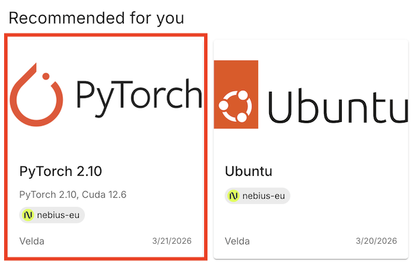
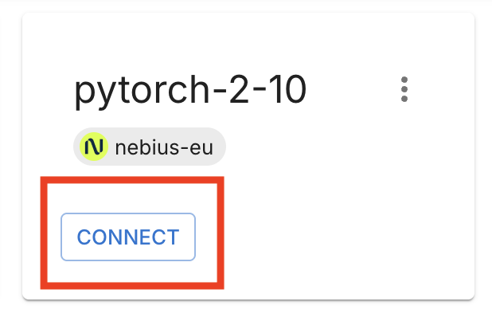

## Train your first model on Velda Cloud

This short guide shows how to launch your first model training job on [Velda Cloud](https://cloud.velda.io) in under two minutes.

### 1. Sign in or Register on Velda Cloud

Go to [https://cloud.velda.io](https://cloud.velda.io) and sign in with your Velda account.

### 2. Create a Velda instance (PyTorch template)

A Velda instance is a virtual environment with dynamic compute resource.

Click the **PyTorch 2.10** template to create a pre-configured instance that includes a ready-to-run example and the necessary dependencies.



### 3. Connect to your instance

After the instance is created, click **Connect**. Velda launches a Code-server session in your browser with a default workspace containing example projects.



This workspace is yours: edit code, install packages, or open the project in your preferred IDE using SSH or the provided connection details.

### 4. Run the example training job

Open the terminal in Code-server (`` Ctrl+` `` on Windows/Linux, `` Control+` `` on macOS) and run:

```bash
vrun -P h100-1 pytorch_examples/example_train.py
```

You should see the training job start and job output in the terminal. This training job will be running on H100 GPU instance.


## Your First `vrun` Command

The `vrun` command executes commands on remote resources.

```bash
# This runs on a different machine as your shell.
vrun echo "Hello from Velda!"
```

Use `vbatch` to run the command in the background:
```bash
# Run in the background
JOB_ID=$(vbatch ./long-jobs.sh)
# View logs
velda tasks log ${JOB_ID}
```

## Using Resource Pools

Resource pools provide access to different compute configurations. Consult your cluster admin for pool configuration. Use the `-P` flag to specify a pool:

```bash
# List available pools
velda pool list

# Run on default pool (shell, typically 1-4 cpus)
vrun python train.py

# Run on CPU-intensive pool
vrun -P cpu-large make -j 16

# Run on GPU pool in the background
vbatch -P gpu-t4 python train.py

# Run on high-end GPU pool
vbatch -P gpu-a100-8 python train.py --distributed
```

## Install Packages

Velda guarantees your environment will be consistent when you scale, so you can install packages normally inside your Velda instance:

```bash
# Python packages
pip install torch torchvision transformers

# System packages
sudo apt update && sudo apt install -y htop

# Conda environments
conda create -n myenv python=3.11
conda activate myenv
pip install -r requirements.txt
```

## Running Distributed training
Use `vbatch -N` to start distributed jobs with InfiniBand without extra setup.

```bash
# Start 4 synchronized workers for distributed training
vbatch -N 4 --gang -P gpu-a100-8 python train_distributed.py
```

You may use any backend like `torchrun`, `Ray`.

For velda.cloud, all the pools with suffix `i` supports infiniband.

Example:

```bash
vbatch -N 2 -s train- -P h100-8is sh -c 'torchrun \
    --nnodes=$VELDA_TOTAL_SHARDS \
    --nproc_per_node=8 \
    --node_rank=$VELDA_SHARD_ID \
    --rdzv_id=myjobid \
    --rdzv_backend=c10d \
    --rdzv_endpoint=train-0:29400 \
    train.py'
```

What does it do:

* `-N 2`: Run the command with 2 shards in total.
* `-s train-`: Use `train-[shard-id]` as DNS name for each shard. The `-` suffix indicate the shard ID will be suffixed.
* `-P h100-8is`: Use pool h100-8is, which has 8 H100 GPUs on each node, support infiniband and preemptible(spot).
* `sh -c`: Wrap the command with sh to delay the parsing of environment variable (e.g. `VELDA_SHARD_ID`) until execution time.
* `torchrun`: Setup the distributed job with `torchrun`
* `--node_rank=$VELDA_SHARD_ID`: Set the rank of the node based on the shard ID.
* `--rdzv_endpoint=train-0:29400`: You can use `train-0` to identify the address of the master.
* `train.py`: Your entrypoint of the job.

Currently, velda.cloud allows to run jobs on two preemptible 8xH100/H200 nodes instantly, with no setup or quota required. We're working with investors and data centers to bring more options and capacity, plus gang scheduling support. Stay tuned for the upcoming updates.

### What’s next

- To run custom scripts, replace `pytorch_examples/example_train.py` with your script path.
- Explore [more templates](https://velda.cloud/image-catalog), or set up your own from the Ubuntu templates or a custom container image.
- Explore running with other GPU models, check [pricing](https://velda.io/pricing) for more pool options.
- Use [`vrun --help`](/reference/cli/velda_run/) to see available flags and placement options.